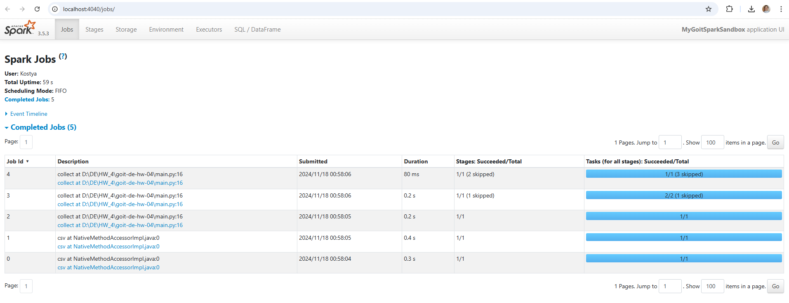
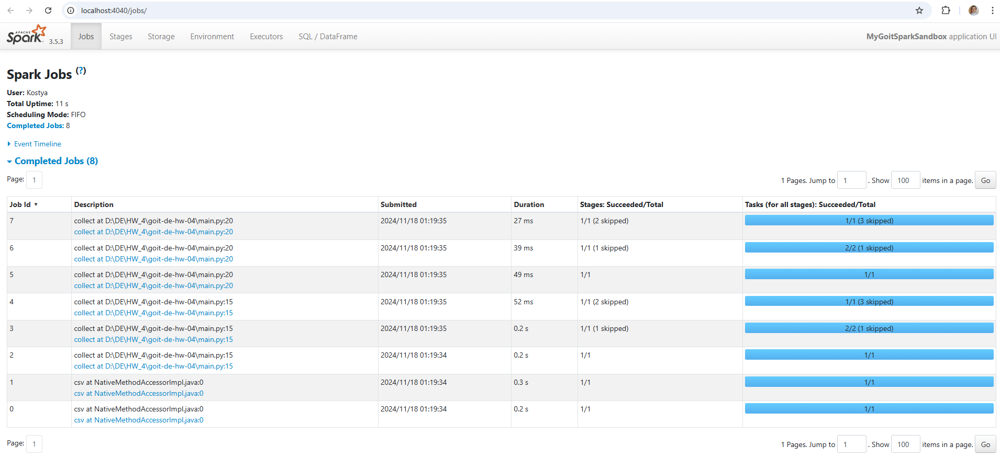
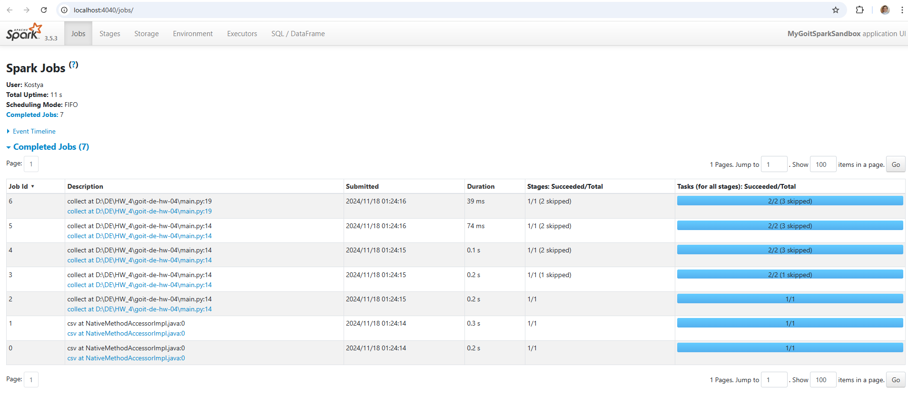

As we can see, there are 5 Jobs in the first screenshot. 
Job #0 read 64 KiB of data from our csv file. It has 3 tasks inside: Scan text, WholeStageCodegen (1) and mapPartitionsInternal.
Job #1 read 453.2 KiB of data from our csv file. It has 5 tasks: 3 of them are the same tasks as Job #0 and additional tasks 
DeserializeToObject and SQLExecutionRDD due to necessety of deserialization from binary.
Job #2 created the first data exchange. It has 3 tasks: Scan csv, WholeStageCodegen (1) and Exchange.
Job #3 created also two exchanges. It has 6 tasks: 3 skipped tasks, because it were done on previous stages, and also 3 tasks:
Exchange, WholeStageCodegen (2) and also one Exchange.
Job #4 did the last part of the program. It has 2 skipped Stages which were done with previous Jobs and 1 comleted Stage 
with 3 tasks: AQEShuffleRead, WholeStageCodegen (3) and mapPartitionsInternal.

We can see 8 Jobs in the second screenshot. I suppose, one command 'collect' added three Jobs due to splitting it to Stages of: reading data 
from Dataset; shuffling and mapping data; and bringing the result to driver node as local collection/array.

We have 7 Jobs in the third picture. Cause we used .cache() function and we dont need re-read of our data (it was Job #5 in the 
previous picture). This data is already cashed and accessible.